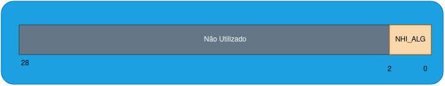

# CoProcessador para o segundo problema do PBL de Sistema Digitais

<h1>

 [Estrutura implementada](#estrutura-do-coprocessador) | [ISA](#conjunto-de-instruções-isa) | [Barramentos](#barramentos)
</h1>

Este coprocessador foi desenvolvido como complemento para o segundo problema de Sistemas Digitais. Tem como objetivo ser um Co-Processador para a realização de zoom in e zoom out em imagens de 320 por 240 pixeis.

<h1>Estrutura do CoProcessador</h1>

# Estrutura do CoProcessador

O CoProcessador desenvolvido implementa uma arquitetura simples, sem pipeline ou qualquer forma de paralelismo, assim se faz necessario esperar uma instrução se encerrar para tentar execultar uma nova. A estrutura do CoProcessador é composta por:

- **Memorias**: É composto por 3 memorias utilizando a arquitetura on chip memory da ciclone V, são 3 memorias do tipo ram dual port com sinais de clock sincronos.
- **UEA**: Unidade dee Execução de Algoritmos. É responsavel por realizar os calculos de endereçamento alem de operar os pixeis de modo a atender ao algortimo escolhido.
- **Unidade de controle**: É responsável por gerenciar o fluxo de dados entre os componentes do CoProcessador alem de gerenciar o envio das flags de resultado para o processador _(HPS)_.
- **Decodificador**: É responsável por decodificar as instruções recebidas do processador _(HPS)_ e enviar os bits para a unidade de controle e para a unidade de execução de algoritmos.
- **Modulo VGA**: Responsavel por exibir as informações da memoria ram 2 na tela atraves da porta _VGA_ Presente na DE1-SoC.

> [!NOTE]
> Até o presente momento a UEA e a UC estão localizadas no mesmo bloco always, mas serão separadas futuramente, sendo a **UEA** movida para o modulo `Memory Control` e a **UC** permanecendo no bloco always atual.

<h2>Tempo de execução das instruções</h2>

## Tempo de execução das instruções

Para cada operação de leitura nas memorias são necessarias 3 ciclos de clock de 100 MHz. alem disso, é necessario mais um ciclo para a finalização e retorno para o estado de espera.
Para a execução de algoritmos o numero de ciclos necessarios é muito superior devido a quantidade de passos a serem execultados.

> [!NOTE]
> Para facilitar a utilização foi inserida uma flag de [done](#barramento-de-flags) que é ativada quando a instrução é concluida, assim basta aguardar o valor dessa flag ser atualizado para 1 para saber que a instrução foi concluida.

<h1>Barramentos</h1>

# Barramentos

O modulo do Coprocessador conta com dois barramentos de entrada e dois de saida

Barramento|Tipo|Tamanho
:---------|:-------|:--------
instruction|Input|29 bits
enable|Input|1 bit
DataOut|Output|8 bits
Flags|Output|4 Bits

<h3>Barramento de Instruções</h3>

## Barramento de instruções

Este barramento é responsavel por enviar ao Coprocessador as instruções a serem execultadas. O barramento de instruções é de 29 bits sendo 3 deles dedicados aos [8 OP Codes](#conjunto-de-instruções-isa)
que o coprocessador possui, as intruções possuem campos e formatos diferentes, sendo assim nem todas as instruções utilizam os 29 bits.

>[!NOTE]
> No coprocessador, esses dados estão seccionados em 4 barramentos distintos mas que podem ser atribuidos a um unico **PIO**.

<h3>Barramento de habilitação do funcioinamento (Enable)</h3>

## Barramento de habilitação do funcioinamento (Enable)

Este barramento serve para informa ao processador que deve ser realizada a instrução que estiver no barramento de instruções. Ele é ativo em nivel logico alto e desativado em nivel logico baixo.

> [!NOTE]
> O sinal ENABLE é utilizado para sincronismo entre o coprocessador e o barramento de instruções.

> [!WARNING]
> **A cada operação deve se alterar o valor para 1 apenas após inserir a instrução no barramento de instruçõe ser realizada, seu valor deve retornar a zero antes da execução da proxima instrução.**

<h3>Barramento de Saida (DATA_OUT)</h3>

## Barramento de Saida (DATA_OUT)

O barramento de saida armazena o valor do endereço solicitado da imagen original ou da imagen alterada pela instrução de load até que um novo valor seja solicitado ou seja realizada alguma outra operação.

<h3>Barramento de Flags</h3>

## Barramento de Flags

O barramento de flags é responsavel por armazenar as flags de _done_, _erro_, *zoom_maximo* e *zoom_minimo*. No coprocessador essas flags estão separadas em quatro saidas distindas, mas podem ser associadas a um unico **PIO**, já que cada flag se trata de um valor unitario. Quando uma das flags for ativa seu valor logico será de 1 , caso contrario seu valor será 0.

Flag|Significado
:----|:-----------
**Error** | Flag ativada quando a operação realizada resulta em algum erro e o valor disponivel em [DATA_OUT](#barramento-de-saida-data_out) é invalido.
**Max_zoom**| Flag ativada quando o zoom maximo foi alcançado, não sendo possivel efetuar uma operação de zoom in após está flag estar ativa.
**Min_zoom** | Flag ativada quando o zoom minimo foi alcaçado, não sendo possivel efetuar uma operação de zoom out após está flag estar ativa.
**Done** | Flag ativada quando uma operação é finalizada.

<h1>Conjunto de Instruções (ISA)</h1>

# Conjunto de instruções (ISA)

O coprocessador conta com um conjunto de 8 instruções que podem ser utilizadas para realizar operações aritmeticas, de armazenamento e de leitura de dados.

>[!WARNING]
> Uma instrução não é uma função, uma instrução é uma sequencia de bits que dizem ao coprocessador o que fazer, não possui um "retorno" como a chamada de uma função. O que acontece é que ao fim da execução de uma instrução, o coprocessador podera colocar um valor no [barramento de saida](#barramento-de-saida-data_out) e/ou atualizar os valores das [flags](#barramento-de-flags), mas não são todas as intruções que possuem uma escrita no barramento de saida ou no barramento de flags.

>[!NOTE]
> Nem todas as operações utilizão todos os 29 bits disponiveis, observar os campos de cada instrução
> para evitar perda de dados ou problemas de funcionamento.

>[!WARNING]
> Os campos das instruções de dos dados **saem do mais significativo para o menos**, ou seja, o campo do opcode da instrução começa
> no bit 0 e vai até o bit 2 e o mesmo se aplica aos demais campos de acordo com a instrução a ser utilizada.

<h3>Tabela de Instruções</h3>

## Tabela de Instruções

 OP Code | Nome da operação | Descrição
 :------ | :-------- |:-------
 000 | [NOP](#nop) |Informa ao coprocessador não realizar nada, usado para bolhas.
 001 | [LOAD](#load) |carrega no barramento de [SAIDA](#barramento-de-saida-data_out) o valor do pixel associado ao endereço solicitado na instrução.
 010 | [STORE](#store) |Usado para guardar um valor de pixel na memoria A.
 011 | [Vizinho mais proximo para zoom in](#vizinho-mais-proximo-para-zoom-in-nhi_alg-instruction) |Usado para realizar operação de vizinho mais proximo para zoom in.
 100 | [Replicação de pixel](#replicação-de-pixel-pr_alg-instruction) |Usado para realizar operação de replicação de pixel para zoom in.
 101 | [Vizinho mais proximo para zoom out](#vizinho-mais-proximo-para-zoom-out-nh_alg-instruction) |Usado para realizar operação de vizinho mais proximo para zoom out.
 110 | [Média de blocos](#media-de-blocos-ba_alg-instruction) |Usado para realizar operação de media de blocos para zoom out.
 111 | [Reset](#rst) |Usado para reiniciar o coprocessador, retornar o zoom para o padrão e a imagem para a default.

Descrição detalhada de cada uma das instruções com seus respectivos campos e possiveis [flags](#barramento-de-flags)

>[!NOTE]
> A unica instrução capaz de retornar um valor pelo [barramento de dados](#barramento-de-saida-data_out) é a intrução de [LOAD](#load), todas as outras não retornam ou alteram
> o valor que esta no barramento

>[!WARNING]
> Para realizar uma operação sobe uma imagem de tamanho maximo 320x240 é necessario realizar a operação de [STORE](#store) 76800 vezes, sabendo que a cada vez que a instrução é realizada, é armazenado o valor de um pixel na memoria A que guarda a imagem original.

<b>NOP instruction</b>

### NOP

**Campos da instrução NOP**

Nome do Campo| Descrição | tamanho |Bit final| Bit inicial
:---------|:---------|:---------|:---------|:----------
Opcode| Codigo da operação (000) | 3 bits| 2 | 0
Não usados | | 26 bits| 28| 3

**Flags que podem ser ativadas**
> Essa instrução não tiva nenhuma flag execeto a flag de [DONE](#barramento-de-flags)

  <figure>
    
    <figcaption>
      

        <b>Figura 2</b> - Estrutura da instrução NOP
      

    </figcaption>
  </figure>

<b>LOAD instruction</b>

### LOAD

**Campos da instrução LOAD**

Nome do Campo| Descrição | tamanho |Bit final| Bit inicial
:---------|:---------|:---------|:---------|:----------
Opcode    | Opcode da instrução (001)| 3 bits| 2 | 0
Address   | Endereço do pixel a ser lido | 17 bits| 19 | 3
Sel Mem   | Memoria a ser lida | 1 bit| 20 | 20
Não usados| | 9 bits| 28| 21

>[!NOTE]
> Para endereçamento o valor pode ir de 0 a 76799, case seja passado um valor maior que este a flag de **erro** será ativa.

- **Flags que podem ser ativadas**
  - `Error` Endereçamento incorreto ou falha na leitura.
  - `Done` Fim da execução da instrução

  <figure>
    
    <figcaption>
      

        <b>Figura 3</b> - Estrutura da instrução LOAD
      

    </figcaption>
  </figure>

<b>STORE instruction</b>

### STORE

**Campos da instrução STORE**

Nome do Campo| Descrição | tamanho |Bit final| Bit inicial
:---------|:---------|:---------|:---------|:----------
Opcode| Opcode da instrução (010)|3 bits| 2 | 0
Address| endereçamento que o pixel será escrito | 17 bits | 19 | 3
Sel Mem| Campo não utilizado| 1 bit| 20 | 20
Valor| valor do pixel a ser escrito com 8 bits, em escala de cinza| 8 bits | 28 | 21

>[!NOTE]
> O valor maximo para endereçamento é de 76799, caso seja passado um valor maior que este a flag de erro será ativada.

>[!WARNING]
> Sempre que um dado for escrito, toda a imagem será recarregada na memoria de leitura utilizada pelo vga.

- **Flags que podem ser ativadas**
  - `Error` Endereçamento incorreto ou falha na escrita.
  - `Done` Fim da execução da instrução

  <figure>
    
    <figcaption>
      

        <b>Figura 4</b> - Estrutura da instrução STORE
      

    </figcaption>
  </figure>

<b>Vizinho mais proximo para zoom in (NHI_ALG instruction)</b>

### Vizinho mais proximo para zoom in (NHI_ALG instruction)

**Campos da instrução NHI_ALG**

Nome do Campo| Descrição | tamanho |Bit final| Bit inicial
:---------|:---------|:---------|:---------|:----------
Opcode|Opcode da instrução (011)| 3 bits| 2|0
Não usados| | 26 bits| 28|3

- **Flags que podem ser ativadas**
  - `Max zoom` Foi alcançado o zoom maximo de 8x permitido pelo coprocessador
  - `Error` falha na realização da operação.
  - `Done` Fim da execução da instrução

  <figure>
    
    <figcaption>
      

        <b>Figura 5</b> - Estrutura da instrução NHI_ALG
      

    </figcaption>
  </figure>

<b>Replicação de Pixel (PR_ALG instruction)</b>

### Replicação de Pixel (PR_ALG instruction)

**Campos da instrução PR_ALG**

Nome do Campo| Descrição | tamanho |Bit final| Bit inicial
:---------|:---------|:---------|:---------|:----------
Opcode| Opcode da instrução (100)| 3 bits | 2 | 0
Não usados| | 26 bits| 28|3

- **Flags que podem ser ativadas**
  - `Max zoom` Foi alcançado o zoom maximo de 8x permitido pelo coprocessador
  - `Error` falha na realização da operação.
  - `Done` Fim da execução da instrução
  

  <figure>
    
    <figcaption>
      

        <b>Figura 6</b> - Estrutura da instrução PR_ALG
      

    </figcaption>
  </figure>

<b>Vizinho mais proximo para zoom out (NH_ALG instruction)</b>

### Vizinho mais proximo para zoom out (NH_ALG instruction)

**Campos da instrução NH_ALG**

Nome do Campo| Descrição | tamanho |Bit final| Bit inicial
:---------|:---------|:---------|:---------|:----------
Opcode| Opcode da instrução (101)| 3 bits | 2 | 0
Não usados| | 26 bits| 28|3

- **Flags que podem ser ativadas**
  - `Min zoom` Foi alcançado o zoom minimo de 0,125x permitido pelo coprocessador
  - `Error` falha na realização da operação.
  - `Done` Fim da execução da instrução

  <figure>
    
    <figcaption>
      

        <b>Figura 7</b> - Estrutura da instrução NH_ALG
      

    </figcaption>
  </figure>

<b>Media de blocos (BA_ALG instruction)</b>

### Media de blocos (BA_ALG instruction)

**Campos da instrução MULM**

Nome do Campo| Descrição | tamanho |Bit final| Bit inicial
:---------|:---------|:---------|:---------|:----------
Opcode| Opcode da instrução (110)| 3 bits | 2 | 0
Não usados| | 26 bits| 28|3

- **Flags que podem ser ativadas**
  - `Min zoom` Foi alcançado o zoom minimo de 0,125x permitido pelo coprocessador
  - `Error` falha na realização da operação.
  - `Done` Fim da execução da instrução

  <figure>
    
    <figcaption>
      

        <b>Figura 8</b> - Estrutura da instrução BA_ALG
      

    </figcaption>
  </figure>

<b>RST instruction</b>

### RST

**Campos da instrução RST**

Nome do Campo| Descrição | tamanho |Bit final| Bit inicial
:---------|:---------|:---------|:---------|:----------
Opcode| Opcode da instrução (111)| 3 bits | 2 | 0
Não usado| | 26 bits | 28 | 3

**Flags que podem ser ativadas**
> Essa instrução não tiva nenhuma flag, execeto a flag done.

  <figure>
    
    <figcaption>
      

        <b>Figura 9</b> - Estrutura da instrução RST
      

    </figcaption>
  </figure>

